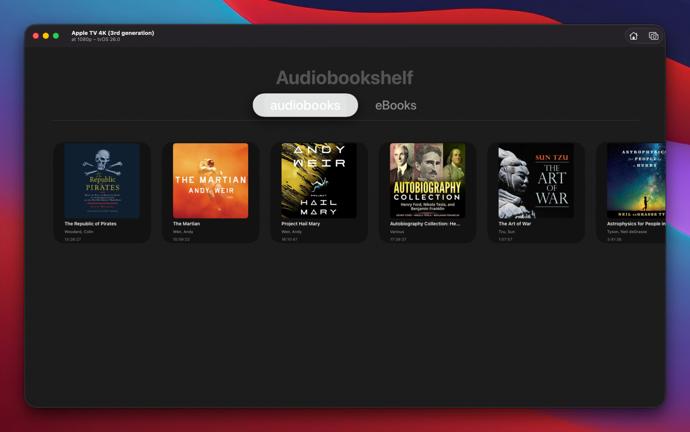
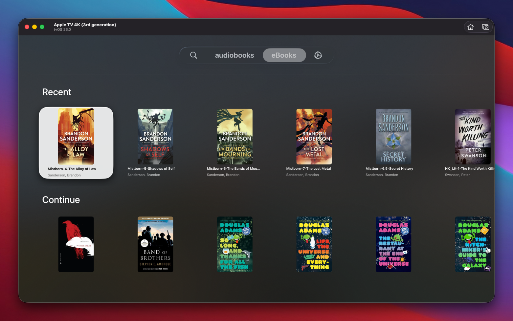
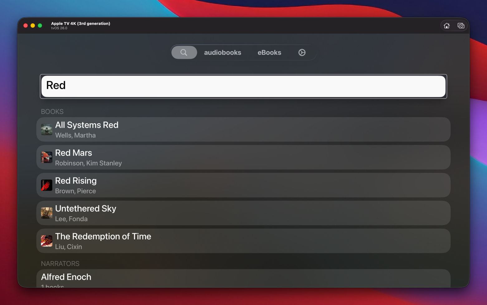
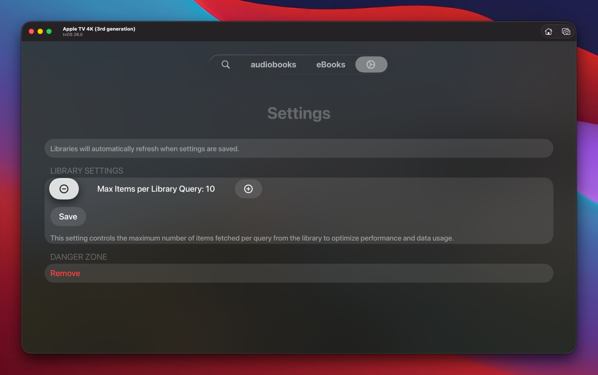

# SwiftShelf

SwiftShelf is a tvOS Audiobookshelf client built in SwiftUI. It combines fast, focused navigation of your Audiobookshelf libraries with fully integrated playback, presenting your collection in a sleek carousel interface that stays remote-friendly.

## Key Features

- **Authenticated Connection & Secure Storage**  
  Log in with your Audiobookshelf host and API key. Credentials are persisted in the system Keychain so reconnecting after app relaunches is seamless, and a logout from Settings clears everything.
  
- **Library Selection & Persistence**  
  Choose from your available Audiobookshelf libraries. The app remembers your last selected library and skips the selector if already chosen.

- **Recent & Continue Listening Carousels**  
  Browse your most recently added audiobooks and quickly jump back into in-progress titles. Each carousel is focus-aware and shows cover artwork, author, and duration with playback progress overlays.
  
  
  

- **Search with Smart Shortcuts**  
  Query your Audiobookshelf library with the same semantics as the web client. Results are grouped by books, narrators, and series, and recent search terms stay pinned for one-click access.
  

- **Detailed Item Popup & Quick Play**  
  Selecting a title opens a blurred tvOS-style sheet with artwork, author, series, runtime, and a prominent play button that feeds directly into the player.

- **Compact Mini Player**  
  A persistent bottom banner mirrors what’s playing with artwork, elapsed time, transport controls, and quick speed adjustments so you can manage audio without leaving the browse UI.
  

- **Customizable Experience**  
  Tune how many items each library fetches, pick the carousel progress-bar color (including rainbow), and set a preferred default playback speed. All settings persist and trigger live refreshes.
  

- **Authenticated Cover Fetching**  
  Cover images are fetched securely from the Audiobookshelf `/cover` endpoint with your credentials and cached in-memory for smooth, fast browsing.

- **Optimized for tvOS Navigation**  
  All carousels and lists are remote-friendly and visually respond to focus changes for a fluid tvOS experience.

## Example Flow

1. **Login**: Supply host and API key on the login screen.  
2. **Library Selection**: Choose which library(ies) you want to work with.  
3. **Browse**: Explore recent and in-progress items, or use search to jump directly to what you need.  
4. **Play**: Open a title to review its details and start playback; control audio via the mini player or full-screen experience.

## Requirements

- tvOS Simulator or device  
- Audiobookshelf instance with API access (host URL and API key)  

## Configuration

- `host`: Your Audiobookshelf base URL (e.g., `https://library.example.net`)  
- `apiKey`: Bearer API key from your Audiobookshelf user settings  
- Optional (DEBUG builds): Add a `.swiftshelf-config.json` next to the app bundle with `host` and `apiKey` to auto-populate the login form during development. An example file lives at `.swiftshelf-config.example.json`.
