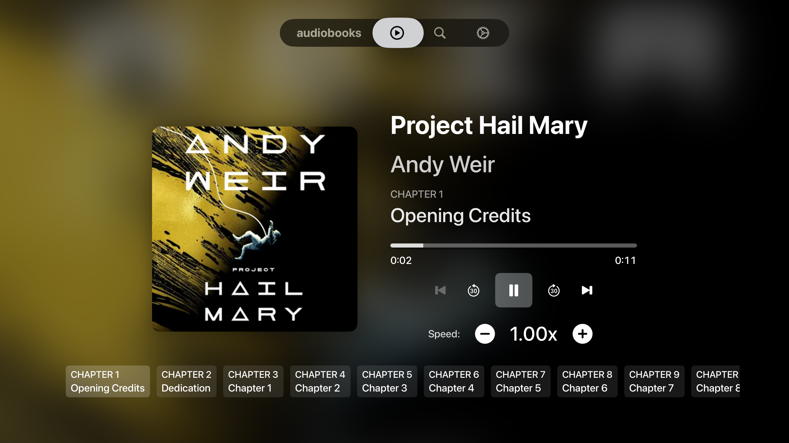

# SwiftShelf

  

SwiftShelf is a tvOS Audiobookshelf client built in SwiftUI. It combines fast, focused navigation of your Audiobookshelf libraries with fully integrated playback, chapter navigation, and progress syncing, presenting your collection in a sleek carousel interface that stays remote-friendly.

TestFlight: https://testflight.apple.com/join/hvv1CqfB

Tear it apart, and leave some comments in the Issues tab!

## Key Features

### Connection & Authentication
- **Authenticated Connection & Secure Storage**
  Log in with your Audiobookshelf host and API key. Credentials are persisted in the system Keychain so reconnecting after app relaunches is seamless, and a logout from Settings clears everything.

- **Library Selection & Persistence**
  Choose from your available Audiobookshelf libraries. The app remembers your last selected library and skips the selector if already chosen.

### Library Browsing
- **Recent & Continue Listening Carousels**
  Browse your most recently added audiobooks and quickly jump back into in-progress titles. Each carousel is focus-aware and shows cover artwork, author, and duration with playback progress overlays.
  

- **Search with Smart Shortcuts**
  Query your Audiobookshelf library with the same semantics as the web client. Results are grouped by books, narrators, and series, and recent search terms stay pinned for one-click access.
  

### Item Details & Playback
- **Full-Screen Item Detail View**
  Selecting a title opens a polished full-screen view with cover artwork, author, description, and a chapter list. Navigate directly to any chapter or start playback with the prominent play button.
  

- **Chapter Navigation**
  Browse and select chapters directly from the detail view. Each chapter shows its title and duration, with visual feedback for the currently playing chapter. Jump to any chapter instantly while maintaining playback state.

- **Now Playing Tab**
  A dedicated full-screen player view with:
  - Large cover artwork and metadata
  - Chapter-aware progress bar with visual chapter markers
  - Transport controls: previous chapter, skip back 30s, play/pause, skip forward 30s, next chapter
  - Playback speed adjustment (0.5x - 3.0x in 0.25x increments)
  - Real-time progress updates
  

- **Background Audio Support**
  Audio continues playing when you navigate between screens or return to the home screen. Perfect for long listening sessions across multiple apps.

### Progress & Sync
- **Server Progress Tracking**
  Playback progress syncs with your Audiobookshelf server every 10 seconds. Resume where you left off across all your devices (web, mobile, tvOS).

- **Session Management**
  Listening sessions are tracked and reported to the server, including total time listened and playback position. View your listening history and stats on the Audiobookshelf web interface.

- **Smart Resume**
  When you select a title, the app automatically loads your last playback position from the server and resumes 5 seconds before where you stopped.

### Customization
- **Customizable Experience**
  Tune how many items each library fetches, pick the carousel progress-bar color (including rainbow), and set a preferred default playback speed. All settings persist and trigger live refreshes.
  

- **Authenticated Cover Fetching**
  Cover images are fetched securely from the Audiobookshelf `/cover` endpoint with your credentials and cached in-memory for smooth, fast browsing.

- **Optimized for tvOS Navigation**
  All carousels, lists, and player controls are remote-friendly with visual focus indicators and fluid animations for a premium tvOS experience.

## Example Flow

1. **Login**: Supply host and API key on the login screen.
2. **Library Selection**: Choose which library(ies) you want to work with.
3. **Browse**: Explore recent and in-progress items, or use search to jump directly to what you need.
4. **View Details**: Select a title to see its full details, chapters, and description.
5. **Play**: Start playback from the detail view or jump to a specific chapter. Use the Now Playing tab for full playback controls.
6. **Control**: Adjust speed, skip chapters, or jump back 30 seconds using the remote-friendly controls.
7. **Resume Anywhere**: Your progress syncs automatically - pick up where you left off on any device.

## Requirements

- tvOS Simulator or device
- Audiobookshelf instance with API access (host URL and API key)

## Configuration

- `host`: Your Audiobookshelf base URL (e.g., `https://library.example.net`)
- `apiKey`: Bearer API key from your Audiobookshelf user settings
- Optional (DEBUG builds): Add a `.swiftshelf-config.json` next to the app bundle with `host` and `apiKey` to auto-populate the login form during development. An example file lives at `.swiftshelf-config.example.json`.
