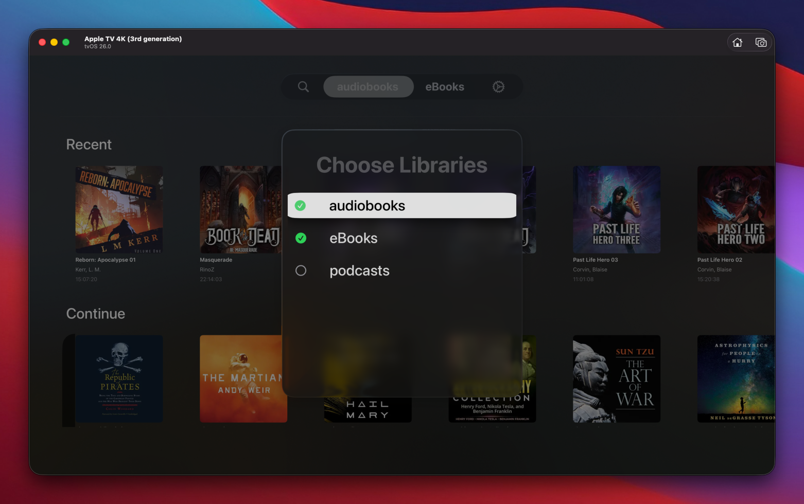

# SwiftShelf

SwiftShelf is a tvOS Audiobookshelf client built in SwiftUI. It combines fast, focused navigation of your audiobook libraries with authenticated playback [eventually], presenting your collection in a sleek carousel interface.

## Key Features

- **Authenticated Connection**  
  Enter your Audiobookshelf host and API key to securely connect. SwiftShelf stores nothing sensitive beyond runtime memory and uses Bearer authentication for all API calls.
  

- **Library Selection**  
  Pick one or more libraries to work with. If you’ve already selected a library, the app will skip straight to its contents on launch.
  

- **Carousel-style Recent Items View**  
  Browse the most recently updated items in a horizontally scrolling, focus-aware carousel. Artwork is large and square, with title, author, and runtime displayed beneath.
  
  

- **Authenticated Cover Fetching**  
  Covers are loaded securely via the Audiobookshelf `/cover` endpoint with the same credentials, and cached in-memory for smooth scrolling.

<!-- - **Quick Playback Popup**  
  Select an item to open a media player overlay that streams from the authenticated `/play` endpoint, showing metadata and cover art. -->

## Example Flow

1. **Login**: Supply host and API key on the login screen.  
2. **Library Selection**: Choose which library(ies) you want to work with.  
3. **Browse**: SwiftShelf shows the latest items in a carousel with artwork, title, author, and duration.  

## Requirements

- tvOS Simulator or device  
- Audiobookshelf instance with API access (host URL and API key)  

## Configuration

- `host`: Your Audiobookshelf base URL (e.g., `https://library.example.net`)  
- `apiKey`: Bearer API key from your Audiobookshelf user settings  

