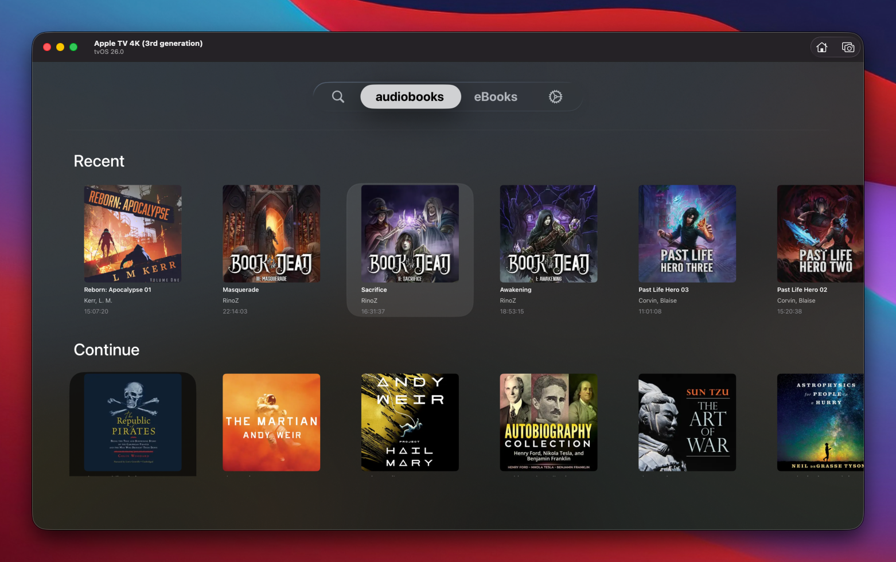
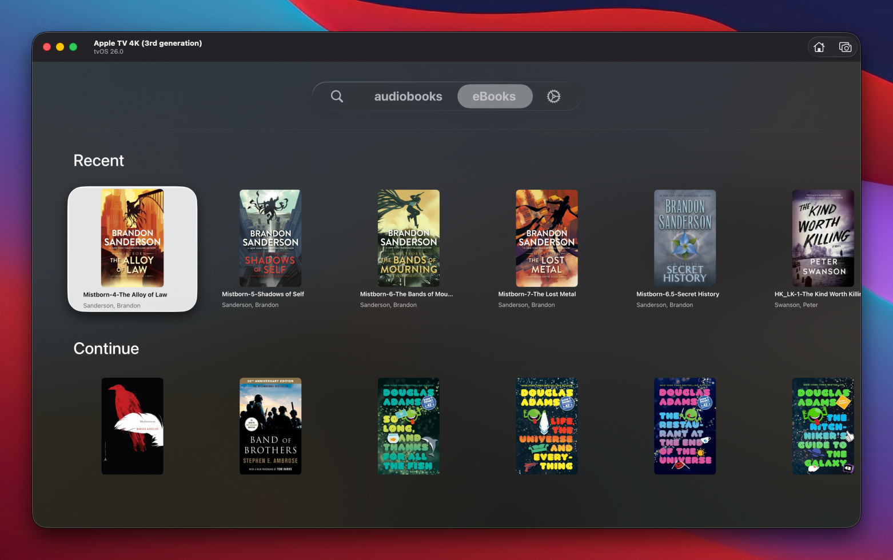

# SwiftShelf

SwiftShelf is a tvOS Audiobookshelf client built in SwiftUI. It combines fast, focused navigation of your audiobook libraries with authenticated playback [eventually], presenting your collection in a sleek carousel interface.

## Key Features

- **Authenticated Connection**  
  Secure login using your Audiobookshelf host and API key. All API requests use Bearer authentication, and nothing sensitive is stored beyond runtime memory.

- **Library Selection & Persistence**  
  Choose from your available Audiobookshelf libraries. The app remembers your last selected library and skips the selector if already chosen.
  

- **Recent Items Carousel**  
  Browse your most recently added audiobooks in a horizontally scrolling, focus-aware carousel. Each item displays large cover artwork, title, author, and runtime.
  
  

- **User-Configurable Item Limit**  
  Adjust how many recent/in-progress items are shown per library (saved as a persistent app setting).
  

- **Search**  
  Similar search functionality to the ABS web client
  

- **Continue Listening (In-Progress) Carousel**  
  A separate carousel shows items you haven't finished, helping you pick up right where you left off.

- **Authenticated Cover Fetching**  
  Cover images are fetched securely from the Audiobookshelf `/cover` endpoint with your credentials, and cached in-memory for smooth, fast browsing.

- **Detailed Item Popup**  
  Selecting an item opens a detailed view with cover art, title, author, series, duration, and more metadata.

- **Integrated Media Player - eta son**  
  Selecting an item opens a playback interface for streaming your audiobooks directly from Audiobookshelf (where supported).

- **Optimized for tvOS Navigation**  
  All carousels and lists are remote-friendly and visually respond to focus changes for a fluid tvOS experience.

## Example Flow

1. **Login**: Supply host and API key on the login screen.  
2. **Library Selection**: Choose which library(ies) you want to work with.  
3. **Browse**: SwiftShelf shows the latest items in a carousel with artwork, title, author, and duration.  

## Requirements

- tvOS Simulator or device  
- Audiobookshelf instance with API access (host URL and API key)  

## Configuration

- `host`: Your Audiobookshelf base URL (e.g., `https://library.example.net`)  
- `apiKey`: Bearer API key from your Audiobookshelf user settings  
